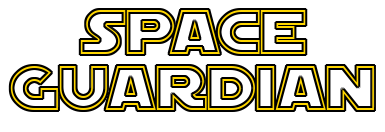
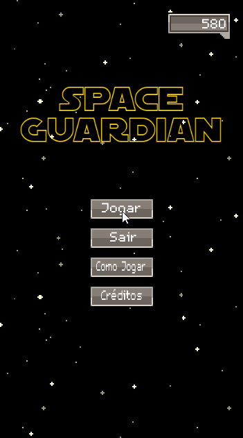

<h1 align="center">
    
</h1>

<h1 align="center">
    
</h1>

# Índice

- [Sobre](#-sobre)
- [Tecnologias utilizadas](#-tecnologias-utilizadas)
- [Contato](#-contato)

## 🔖 Sobre

O projeto **Space Guardian** é um divertido jogo 2D inspirado no clássico Space Invaders, onde o objetivo é sobreviver pelo maior tempo possível para bater seu próprio recorde ou o de seus amigos!

---

## 💻 Tecnologias utilizadas

O projeto foi desenvolvido utilizando as seguintes tecnologias:

- [GDScript](https://docs.godotengine.org/pt_BR/stable/tutorials/scripting/gdscript/gdscript_basics.html)
- [Godot Engine](https://godotengine.org)

---

## 📞 Contato

 

<h3 align="center">
  Feito com ❤️ por Leonardo Santana
</h3>
